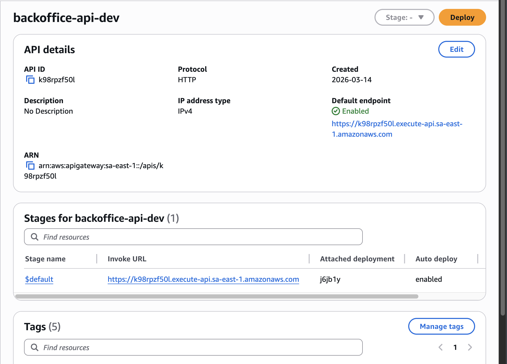
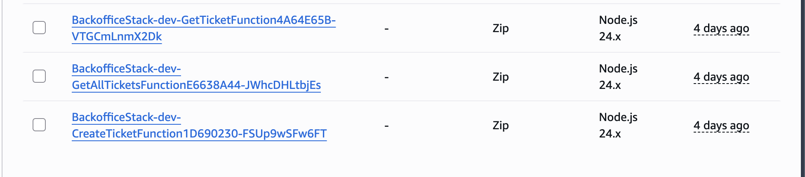
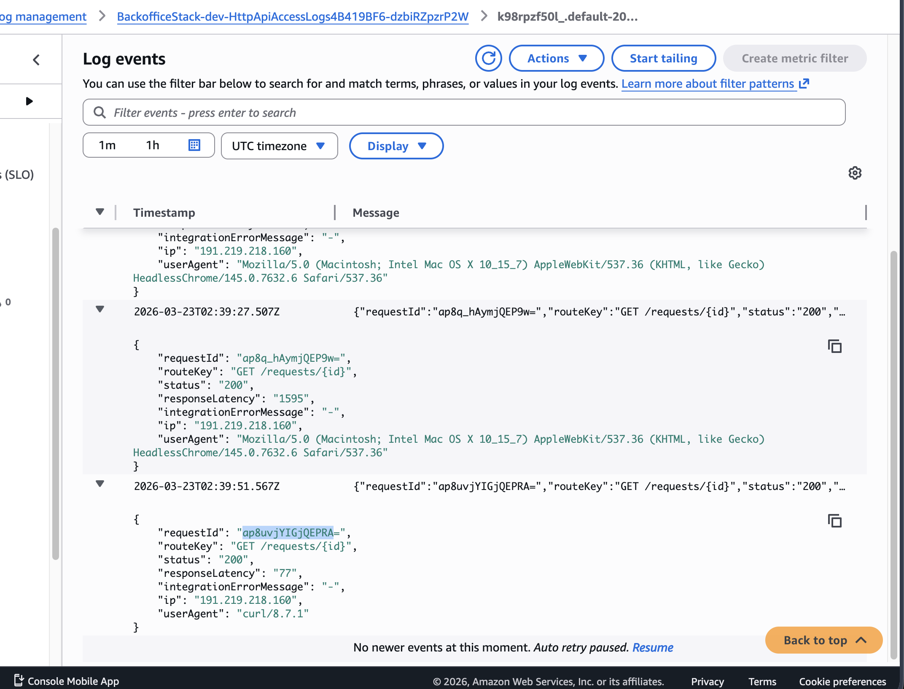
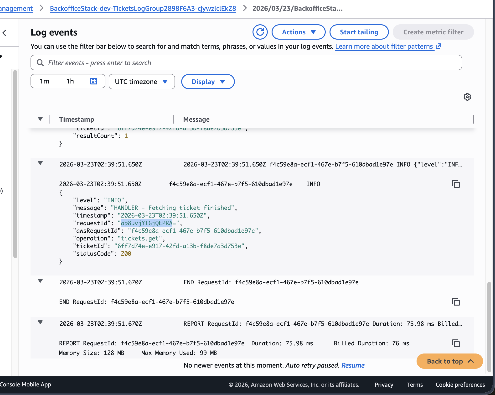

# Backoffice API

API serverless para gestão de solicitações (`requests`), construída em Node.js + TypeScript com AWS CDK (API Gateway + Lambda + DynamoDB).

## Requisitos

- Node.js >= 24
- Docker (para execução local com DynamoDB local)
- AWS CLI configurado (apenas para deploy AWS via CDK)

## Como rodar local

O fluxo local usa DynamoDB local + API Node.

Lembre-se de ter o docker rodando, para que o dev-server consiga se conectar ao DynamoDB local.

```bash
cd backoffice-api
cp .env.example .env
npm install
npm run dev
```

API local padrão: `http://localhost:3000`

Para encerrar, e limpar os recursos do Docker:

```bash
cd backoffice-api
npm run dev:down
```

## Variáveis de ambiente

Copie `.env.example` para `.env` antes de rodar local. O Docker Compose e o dev server leem as variáveis deste arquivo:

- `TABLE_NAME`: nome da tabela DynamoDB (local padrão: `backoffice-api-local-tickets`)
- `AWS_REGION`: região AWS (padrão local: `sa-east-1`)
- `DYNAMODB_ENDPOINT`: endpoint do DynamoDB local (`http://localhost:8000`). O Docker Compose sobrescreve este valor para o hostname interno automaticamente. Só serve para identificar que estamos rodando localmente (fora da AWS).
- `PORT`: porta HTTP da API local (padrão: `3000`)

## CORS

A API na AWS aceita requests apenas de `https://bliss-front.pedrosatin.com`. Configurável em `lib/backoffice-api-stack.ts`.

> `curl` e chamadas server-side não são afetados por CORS — a restrição se aplica apenas a browsers.

## Endpoints

- `POST /requests`
- `GET /requests/{id}`
- `GET /requests?createdBy=&status=&limit=&nextToken=`

### Exemplo: criar solicitação

```bash
curl -i -X POST 'http://localhost:3000/requests' \
	-H 'Content-Type: application/json' \
	-d '{
		"title": "Printer broken",
		"description": "Does not turn on",
		"priority": "HIGH",
		"createdBy": "ops@bliss.com"
	}'
```

### Exemplo: buscar por id

```bash
curl -i 'http://localhost:3000/requests/{id}'
```

### Exemplo: listar com filtros

```bash
curl -i 'http://localhost:3000/requests?createdBy=ops@bliss.com&status=OPEN&limit=10'
```

### Exemplo: paginação

```bash
curl -i 'http://localhost:3000/requests?limit=10&nextToken={nextToken}'
```

## Deploy na AWS (CDK)

Antes do primeiro deploy, configure credenciais AWS e bootstrap da conta/região.

```bash
cd backoffice-api
npm install
npm run cdk:synth
npm run cdk:deploy
```

A configuração do CDK está em [backoffice-api-stack.ts](./infra/lib/backoffice-stack.ts). O nome da stack é `BackofficeApiStack`.

### Limpeza de recursos

```bash
cd backoffice-api
npm run cdk:destroy
```

## Evidência de deploy

- API URL: Eu criei um custom domain name para a API Gateway: `https://bliss-api.pedrosatin.com`.
- Exemplo de chamada real:

```bash
curl -i -X POST 'https://bliss-api.pedrosatin.com/requests' \
	-H 'Content-Type: application/json' \
	-d '{
		"title": "Access request",
		"priority": "MEDIUM",
		"createdBy": "qa@bliss.com"
	}'
```

- Resultado esperado: status `201` com `id` gerado e header `x-request-id`.

**API Gateway — detalhes e stages**



**Lambdas — três funções deployadas**



**Log do API Gateway com requestId**



**Log da Lambda com o mesmo requestId**



## Decisões de arquitetura

**Por que CDK em vez do Serverless Framework**
Comecei o projeto usando o Serverless Framework, mas os plugins apresentaram problemas: o plugin do DynamoDB local funciona na v4, mas a v4 exige autenticação; a v2 não suporta Node 20+.

O AWS CDK permite declarar toda a infraestrutura em TypeScript, eliminando templates YAML e tornando a configuração mais direta de manter, achei bem melhor a DX.

**Uma Lambda por endpoint**
Cada um dos três endpoints tem sua própria Lambda, pois separa responsabilidade, debug e carga de forma independente. Permite definir permissões IAM mínimas por função: somente a Lambda de `POST /requests` tem permissão de escrita no DynamoDB.

**Logs inline, não dentro das funções de `response`**
Cogitei mover os logs para dentro das funções utilitárias de resposta (`response.ts`), mas isso exigiria passar parâmetros extras que não pertencem ao propósito dessas funções. No escopo atual achei tranquilo fazer logs diretamente nas camadas de handler/repository/service, mas centralizar os logs seria um bom refact a fazer se o código crescer.

**Minificação do bundle**
O bundle é minificado em produção: resulta em ~2 KB por Lambda. Impossível de inspecionar o código diretamente na AWS, mas os logs estruturados são suficientes para diagnosticar problemas. Para debug local o código fonte está disponível.

---

## Limitações conhecidas / TODOs

- Algumas configurações estão sendo definidas em lugares diferentes (compose, dev-server e CDK) — poderiam ser centralizados.
- Falta/poderia ter um rate limiting na API Gateway.
- Poderia ter um Husky + pre-commit/pre-push para garantir que o linting passe antes de cada commit/push.
- Melhorar cobertura de testes.
