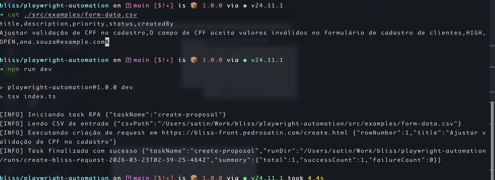
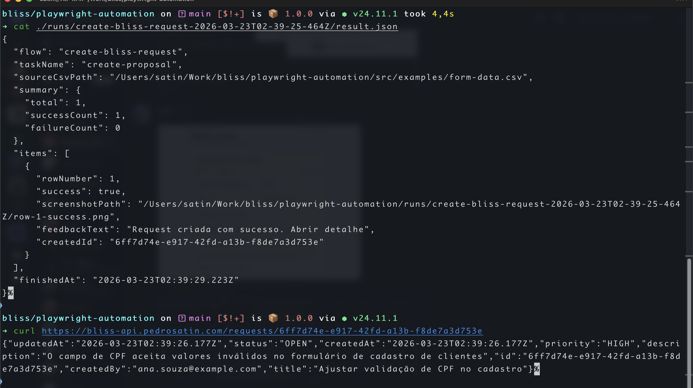
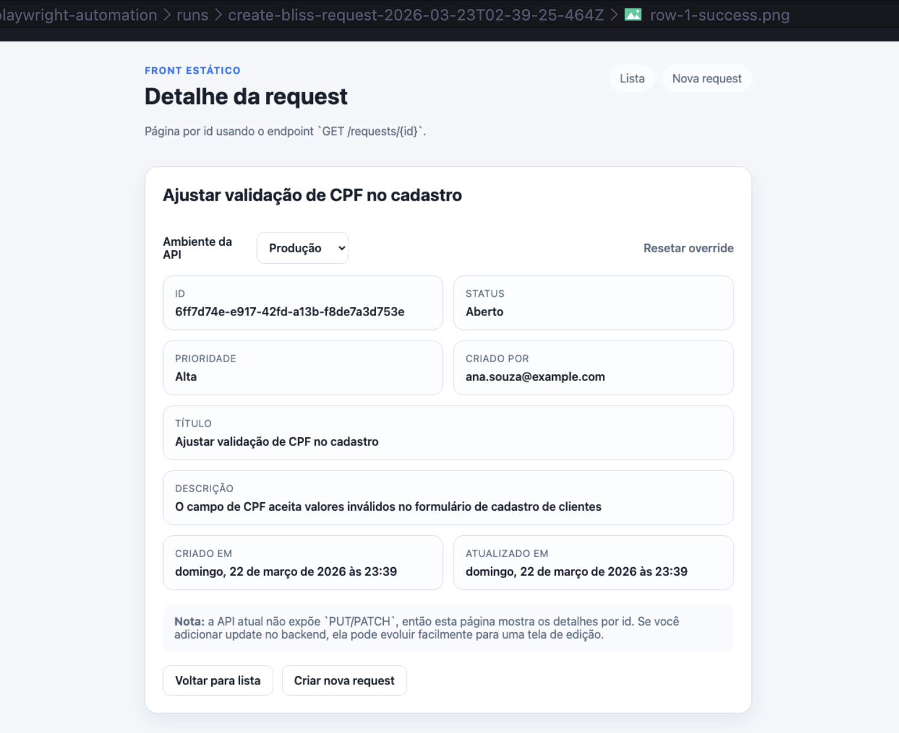
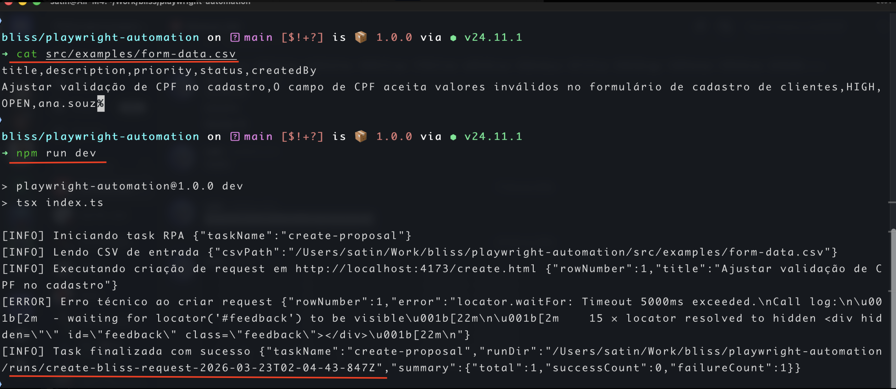
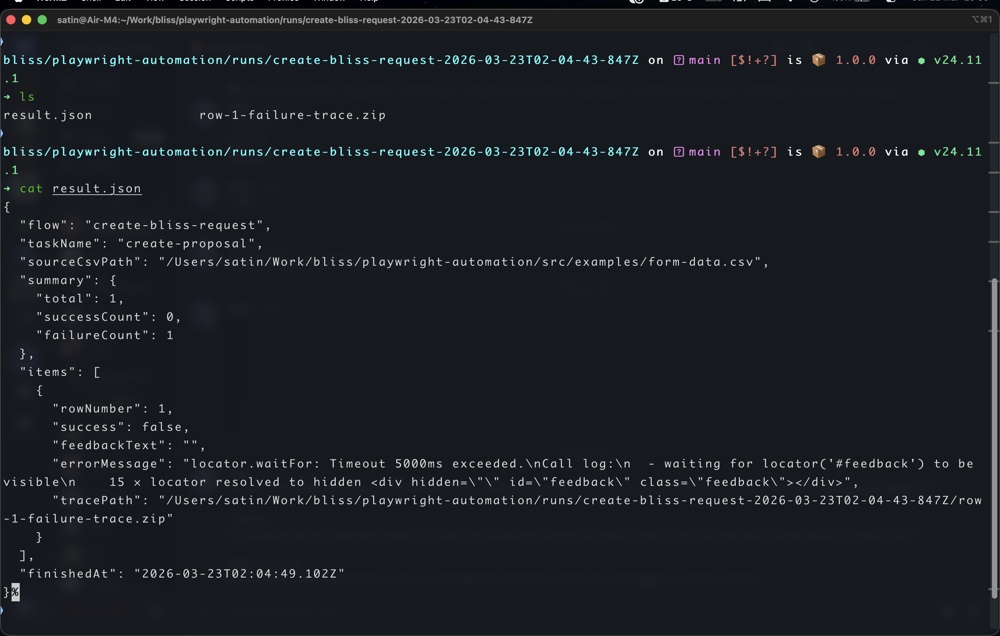
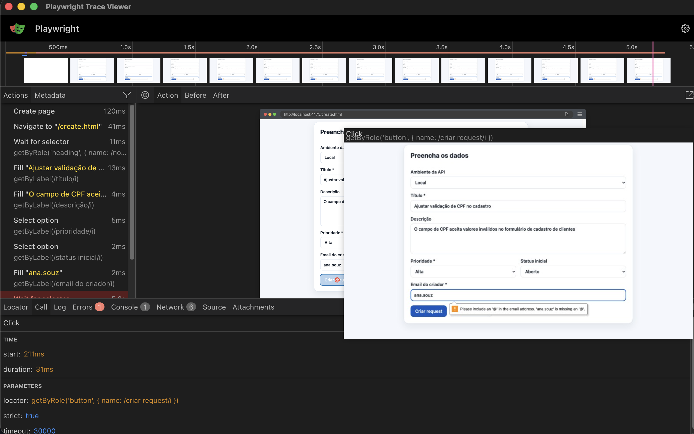

## Playwright Automation — Cadastro em Backoffice

Automação RPA que lê uma planilha CSV e cria requests no backoffice da Bliss via Playwright,
eliminando o trabalho manual repetitivo de cadastro linha a linha.

---

### Pré-requisitos

- Node.js >= 24
- Playwright browsers instalados (`npx playwright install chromium`)

---

### Instalação

```bash
cd playwright-automation
npm install
npx playwright install chromium
```

---

### Configuração

Copie o arquivo de exemplo e ajuste conforme necessário:

```bash
cp .env.example .env
```

| Variável             | Padrão                       | Descrição                                                                                                                                     |
| -------------------- | ---------------------------- | --------------------------------------------------------------------------------------------------------------------------------------------- |
| `BLISS_FRONT_URL`    | `http://localhost:4173`      | URL base do front (sem a página). O padrão aponta para o ambiente local. Para usar o ambiente deployado: `https://bliss-front.pedrosatin.com` |
| `RPA_INPUT_CSV_PATH` | `src/examples/form-data.csv` | Caminho para o CSV de entrada                                                                                                                 |
| `RPA_TASK_NAME`      | `create-proposal`            | Identificador da task no output JSON                                                                                                          |
| `HEADLESS`           | `true`                       | `false` para abrir o browser visível                                                                                                          |

---

### Como rodar

```bash
# Execução padrão (headless, aponta para localhost)
npm run dev

# Com browser visível (útil para inspecionar o fluxo)
npm run dev:headed

# Com Playwright Inspector (passo a passo)
npm run dev:debug

# Apontando para o ambiente deployado em produção
npm run dev:prod
npm run dev:prod:headed
```

---

### Artefatos gerados

Cada execução cria uma pasta em `runs/create-bliss-request-{timestamp}/` com tudo junto:

- `result.json` — sumário completo da execução com status de cada linha
- `row-{n}-success.png` — screenshot full-page em cada sucesso
- `row-{n}-failure-trace.zip` — trace completo de cada falha para inspeção

Os traces podem ser inspecionados com:

```bash
npx playwright show-trace runs/create-bliss-request-.../row-1-failure-trace.zip
```

O `result.json` tem o seguinte formato:

```json
{
  "flow": "create-bliss-request",
  "summary": { "total": 8, "successCount": 7, "failureCount": 1 },
  "items": [
    {
      "rowNumber": 1,
      "success": true,
      "feedbackText": "Request criada com sucesso!"
    }
  ]
}
```

> **Limpeza:** os traces de falha podem ser grandes e acumular bastante espaço em disco.
> Limpe a pasta periodicamente com:
>
> ```bash
> npm run clean
> ```

---

### Formato do CSV de entrada

```csv
title,description,priority,status,createdBy
Validação de CPF,Implementar validação de CPF no cadastro,HIGH,OPEN,dev@empresa.com
```

Colunas obrigatórias: `title`, `description`, `priority`, `status`, `createdBy`

Veja um exemplo completo em [`src/examples/form-data.csv`](src/examples/form-data.csv).

---

### Evidências

**Execução com CSV correto — terminal**



**Result.json após execução bem-sucedida**



**Página de detalhe da request criada**



**CSV com dados no formato errado — terminal**



**Result.json após execução com falha**



**Inspeção do trace de falha no Playwright**



---

### Decisões de arquitetura

**Screenshot em sucesso, trace em falha**
Em caso de sucesso, um screenshot full-page é suficiente para evidenciar que o formulário foi
preenchido e submetido corretamente. O trace completo só é salvo em falhas, onde o contexto extra é necessário
para debugar o problema.

**`fill()` em vez de `pressSequentially()`**
O preenchimento dos campos usa `fill()`, que define o valor instantaneamente — comportamento claramente robótico. A alternativa mais realista seria `pressSequentially()` com um `delay` entre teclas e `page.mouse.move()` para simular foco humano, o que dificultaria a detecção por sistemas anti-bot. A decisão foi manter `fill()` porque o alvo é um sistema próprio sem proteção anti-bot, e o ganho de realismo não justifica a complexidade e lentidão adicionais para este contexto.

**Automatizando um front próprio**
O case-2 automatiza o `backoffice-front`, que foi criado para o case-1 — não um sistema externo.
Isso pode parecer estranho, como testar o resultado de uma função mockada, mas
foi uma decisão consciente: os três projetos formam uma caixa fechada integrada (`API ← front ← automação`),
e o front não é um mock, pois tem validações reais, feedback de erro e navegação.
